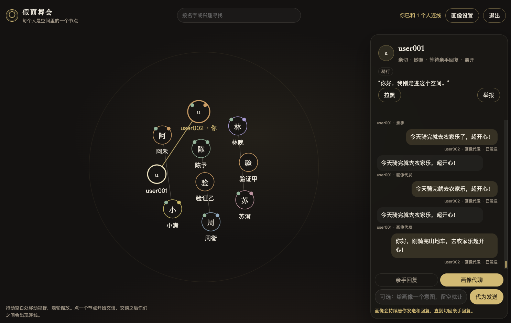

# MaskedBall

假面舞会：一个在浏览器里打开的社交空间。每个人是一个节点，交谈过的人之间会出现连线。你可以亲手回复，也可以让本地模型按你的用户画像代聊。



## 在浏览器里打开

```bash
python3 web/server.py
```

然后打开 [http://127.0.0.1:8787](http://127.0.0.1:8787)。先注册或登录。聊天记录记在本机 SQLite（`web/data/space.sqlite`），登录状态是可作废的会话 cookie。

- 空间里的每个圆点是一个用户，可以拖动、缩放。常驻的人显示为在线；你拉黑的人会从你的图里消失。
- 点开某人开始聊天。发出第一条消息后，你们之间会出现连线。未读会标在节点上。
- 聊天面板可以在「亲手回复」和「画像代聊」之间切换。代聊请求会排队，并受每小时次数限制。
- 「画像设置」里的背景只有你自己看得到。代聊会把它当作上下文，但不会放进别人的名片，也不会放进对方模型的提示词。

账号数据不进 Git。没有配置发信时，重置码由管理员在服务器上生成：

```bash
python3 web/server.py --issue-reset 邮箱
```

设置 `MASKEDBALL_TLS_CERT` 和 `MASKEDBALL_TLS_KEY` 后，进程会改用 HTTPS。`deploy/maskedball.service` 是一份可选的 systemd 单元，需要时再安装，程序本身不会启用它。

## 模块

浏览器只通过 HTTP 和事件流跟进程说话。进程内部按职责分开，互相用函数调用，不共用一套业务规则：

- `accounts` 管注册、密码、会话和重置码
- `portraits` 区分公开名片和代聊用的私有背景
- `conversations` 管两人之间的消息，第三人读不到
- `moderation` 管拉黑和举报
- `model` 管本地模型队列、超时和次数
- `chat` 把一次发送串起来
- `space` 组装当前登录者能看到的图
- `http` 只做路由、cookie 和静态文件

## Project Structure

```
MaskedBall/
├── web/                  # Browser client and Python package
├── deploy/               # Optional systemd unit
└── docs/
    └── SPEC.md
```

## Bot Personality Types

- Friendly - Warm and approachable
- Humorous - Playful and witty
- Mysterious - Enigmatic and intriguing
- Academic - Knowledgeable and precise
- Creative - Imaginative and artistic
- Supportive - Empathetic and encouraging

## Language Styles

- Formal
- Casual
- Internet Slang
- Poetic
- Technical

## Configuration

Your bot's system prompt is generated from:
- Selected personality
- Language style
- Background story (bio)
- Interest keywords
- Custom greeting message


## License

MIT License